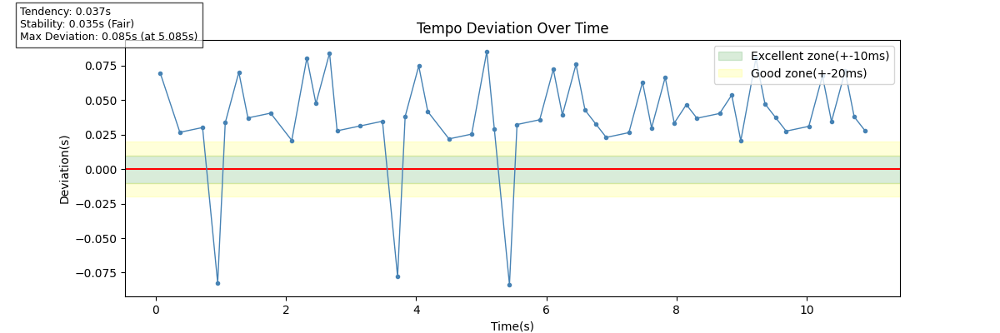

# Rhythm Accuracy Checker

#### Video Demo:  <https://youtu.be/WSV9BiUh134>

#### Description:
Rhythm Accuracy Checker is a command-line tool that takes a drum audio recording as input and analyzes how closely each hit aligns with a steady tempo grid, based on a user-specified BPM and note value. The results are visualized as a time-series graph, along with a numerical summary of the performance's timing accuracy.

## How It Works
1. The user provides a drum audio file, along with the reference BPM and note value(e.g., "BPM: 100", "Note Value: 8" for a track with steady 8th-note hi-hat timing).
2. The tool detects the exact timing of each hit (onset) in the recording.
3. A reference timing grid is generated based on the BPM and note value.
4. Each hit's deviation from the nearest grid point is calculated in seconds.
5. The results are summarized into two separate metrics: **Tendency** (Rushing vs. Dragging) and **Stability** (how much the timing fluctuates).

## Usage
```bash
$ python project.py
File Name: drum_sample_174bpm.mp3
BPM: 174
Note Value: 8
Tendency: 0.037s
Stability: 0.035s (Fair)
Max Deviation: 0.085s (at 5.085s)
Graph saved to tempo_graph.png
```


## Project Files
- `project.py` - Contains the `main` function and all core logic: loading the audio file, detecting onsets, calculating tempo deviations, evaluating stability, and generating the output graph.
- `test_project.py` - Unit tests (written with `pytest`) for `calculate_deviations`, `summarize`, and `evaluate_stability`.
- `requirements.txt` - External libraries required to run the project.
- `drum_sample_174bpm.mp3`, `drum_sample_87bpm.mp3` - Sample drum recordings used for development and the example shown above.
- `tempo_graph.png` - The output graph generated each time the program is run (overwritten on each execution).
- `example_output.png` - A fixed copy of a sample output graph, used for illustration in this README.

## Design Decisions
- **Manual BPM Input (Instead of Automatic Tempo Detection):** If the BPM is automatically detected from the audio itself, the “reference” tempo is derived from a performance that may already contain timing variations, which reduces the reliability of that reference. By specifying the intended BPM, the tool can compare the performance to a fixed external reference and obtain more meaningful deviation measurements.
- **Distinguishing Between Tendency and Stability:** A simple signed mean can be misleading. For example, if some hits are +0.01 seconds early and others are -0.01 seconds late, these effects cancel each other out, resulting in a mean close to zero. This can falsely suggest that the performance was perfectly in time with the tempo, even though there was actually a timing discrepancy. This problem is resolved by dividing the analysis into two metrics. **Tendency** (signed mean) captures whether the performer tends to be ahead or behind overall. In contrast, **Stability** (standard deviation) captures how much the timing fluctuates relative to that tendency, regardless of direction.
- **Introduction of the DeviationSummary Data Class:** Before this refactoring, many individual values (mean, standard deviation, extreme values, times of extreme values, and classification) were passed between functions such as `plot_deviation()` and `summarize()`, and the same summary text was duplicated in both `main()` and `plot_deviation()`. This reduced the code's readability and maintainability. By consolidating these related values into a single DeviationSummary object (using Python's dataclass), the number of parameters passed between functions was reduced, the format of the summary was centralized via a single `as_text()` method, and the duplication was eliminated.

## Limitations
- This tool assumes a single, consistent note value across the entire audio file. If the rhythm pattern changes mid-song (e.g., switching from 8th-note to 16th-note hi-hat patterns), deviation calculations may become less accurate for that section. Users should choose the note value that best represents the dominant rhythm pattern of the track.
- The stability thresholds (10ms / 20ms / 40ms) used in `evaluate_stability()` are not scientifically established cutoffs. They are approximate values informed by research on human timing perception and performance (see References below), adapted for this project.

## References
- Physics Today, ["Musical rhythms: The science of being slightly off"](https://physicstoday.aip.org/quick-study/musical-rhythms-the-science-of-being-slightly-off)
- Friberg, A. and Sundberg, J. (1995), as cited in [Frontiers in Psychology](https://www.frontiersin.org/journals/psychology/articles/10.3389/fpsyg.2017.01709/full)
- ["The Effect of Microtiming Deviations on the Perception of Groove in Short Rhythms"](https://www.academia.edu/21176015/)

